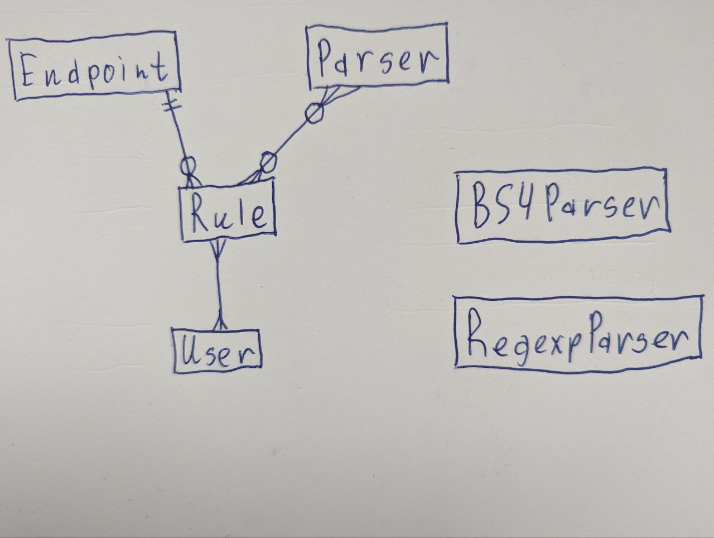
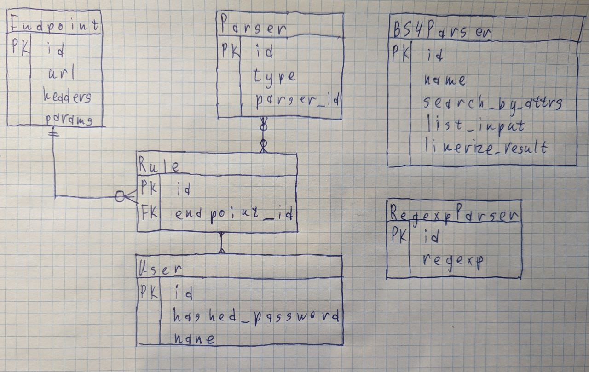
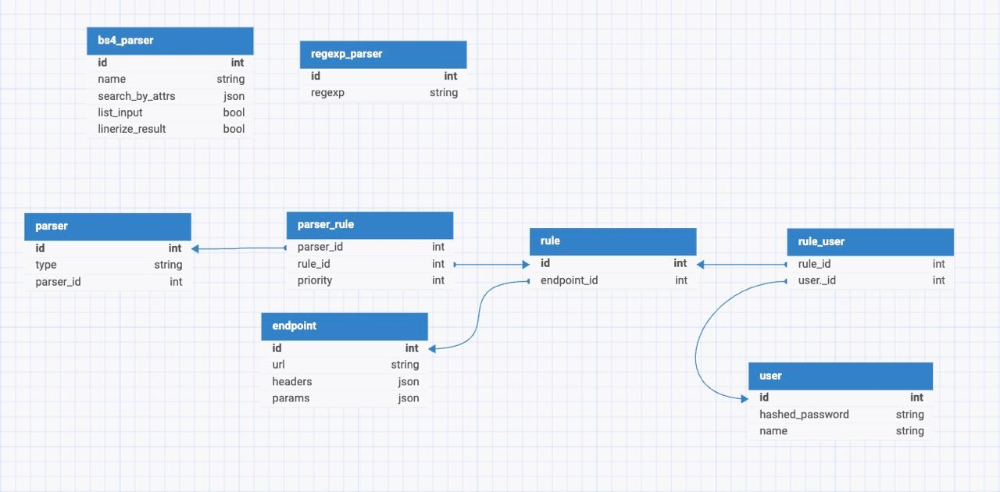

# database_project
1) ### Тема
   В прошлом семестре в качесве дз нам задали проект, 
   который я делал в спешке.
   
   Из-за спешки я не продумал структуру бд, там есть 
   моменты которые меня смущают. Было бы круто в рамках этого 
   задания перепроектировать схему бд, и посмотреть, что получится.
   
   Идея проекта заключалась в том, чтобы создавать правила для 
   парсинга разных сайтов.
2) ### Концептуальная схема
   
   Тут следует дать пояснения:

   **Endpoint** - ручка, которую мы будем дергать, чтобы получить ```html```, 
   который в последствии будем парсить.
   
   **Endpoint** будет содержать поля *url*, *headers*, *params*
   
   ```Parser``` (Говорим сейчас не про модель с рисунка, 
   а в целом про то что это такое) - это объект, который 
   принимает при инициализации некоторую информацию, которая 
   частично определяет его поведение. Так-же этот обьект имеет метод 
   ```parse```, который принимает на вход данные, как-то их обрабатывает,
   и на выход отдает обработанные данные.
   
   Парсеры могут быть абсолютно разные, но в данном проекте рассмотрим
   ```BS4Parer``` и ```RegexpParser```. 

   ```BS4Parser``` основан на
   библиотеке для удобного парсинга ```html``` 
   [BeautifulSoup](https://beautiful-soup-4.readthedocs.io/en/latest/).
   Данный парсер при инициализации будет принимат аргументы, которые
   можно передать в функцию парсинга, например имя тега, 
   который нужно найти, или имя html-класса, который должен присутствовать.
   
   ```RegexpParser``` основан на регулярках, при инициализации будет
   принимать строку - регулярку.

   И тут у меня возникает вопрос.
   Как правильно все это спроектировать в бд?
   Сложность в том, что ```BS4Parser``` и ```RegexpParser``` имеют разный
   набор аттрибутов, то есть в обну таблицу в бд их не запихать. Я разнес
   их по разным одноименных таблицам, и сделал третью таблицу - **Parser**,
   которая будет содержать тип парсера (```regexp```  или ```bs4```) и его
   ```id``` в соответствующей таблице. Теперь в других моделях можно
   ссылаться на модель **Parser** вне зависимости от типа парсера. Но 
   модели **BS4Parser** и **RegexpParser** "болтаются" отдельно, что мне
   не очень нравиться.
   **Rule** - эта сущность содержит всю информацию о том, что нужно
   сделать, а именно какую ручку дернуть (**Endpoint**) и как 
   распарсить полученные данные (ноль, один, 
   или несколько парсеров, через которые нужно прогнать данные)
   **User** - пользователи.
   
   Содержит необходимую инфу о пользователе.

   Пользователи могут добавлять правила в избранное
3) ### Логическая схема
   
4) ### Физическая схема
   
5)

Получить все парсеры, у которых значение поля list_input равно True:
```sql
SELECT * 
FROM bs4_parser
WHERE list_input = TRUE;
```

Получить имена и идентификаторы правил, которые ссылаются на конкретный endpoint:
```sql
SELECT rule.id, rule.endpoint_id, endpoint.url
FROM rule
JOIN endpoint ON rule.endpoint_id = endpoint.id;
```

Получить правила и связанных с ними пользователей:
```sql
SELECT rule.id, rule_user.user_id
FROM rule_user
JOIN rule ON rule_user.rule_id = rule.id;
```

Получить все URL и хедеры из таблицы endpoint, где параметры params содержат определенное значение:
```sql
SELECT url, headers
FROM endpoint
WHERE headers->>'h1' = 'some_val';
```

Получить все правила, у которых количество парсеров больше 2х
```sql
SELECT rule.id, COUNT(parser_rule.parser_id) AS parser_count
FROM rule
JOIN parser_rule ON rule.id = parser_rule.rule_id
GROUP BY rule.id
HAVING COUNT(parser_rule.parser_id) > 2;
```

Вывести все различные адреса
```sql
SELECT DISTINCT endpoint.url
FROM endpoint
ORDER BY endpoint.url;
```

Вывести всю инфу про пользователей и их правила
```sql
SELECT * from db_user 
LEFT JOIN rule_user 
ON db_user.id = rule_user.user_id
LEFT JOIN rule
ON rule.id = rule_user.rule_id;
```

Вывести id пользователей и количество правил у них
```sql
SELECT db_user.id, COUNT(*) from db_user 
LEFT JOIN rule_user 
ON db_user.id = rule_user.user_id
LEFT JOIN rule
ON rule.id = rule_user.rule_id
GROUP BY db_user.id
;
```